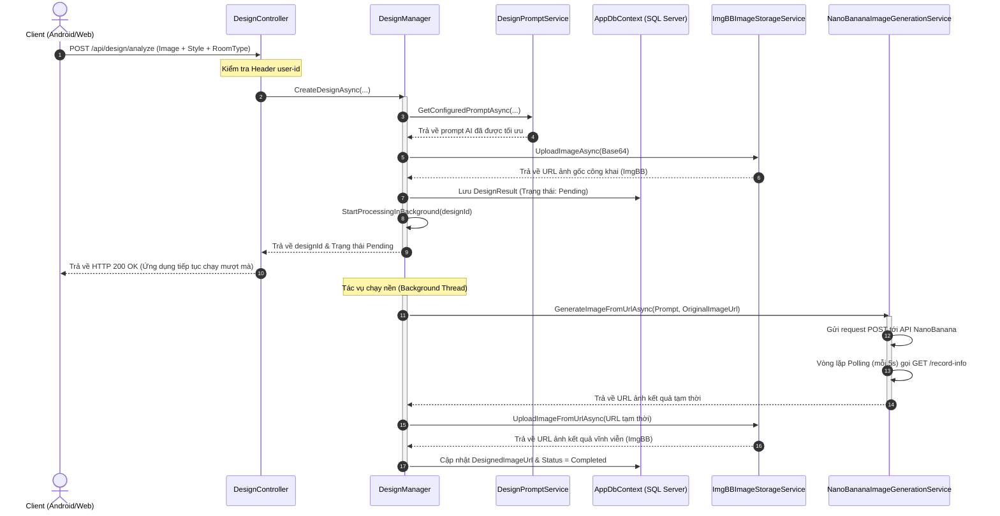

# Phân Tích & Tổng Hợp Các Phần Code Quan Trọng Nhất - Project InteriorAI

Tài liệu này tổng hợp và giải thích chi tiết các phần code quan trọng, cốt lõi nhất của dự án **InteriorAI** (hệ thống Backend thiết kế nội thất sử dụng Trí Tuệ Nhân Tạo). Các thành phần được tổ chức theo kiến trúc phân lớp chuẩn của ASP.NET Core, giải quyết các bài toán về: xử lý tác vụ nền (Background Processing), kết nối API AI bên thứ ba, chuyển đổi kiểu dữ liệu Entity Framework Core, tối ưu hóa truy vấn cơ sở dữ liệu, và phân quyền đơn giản qua Header.

---

## 1. Sơ Đồ Kiến Trúc Hệ Thống (Architecture Flow)

Dưới đây là luồng hoạt động chính khi người dùng gửi một yêu cầu thiết kế phòng:



---

## 2. Các File Code Quan Trọng & Phân Tích Chi Tiết

### 2.1. Cấu Hình Tác Vụ Chạy Nền Tránh Rò Rỉ Bộ Nhớ (Service Lifetime & Background Task)
* **File:** [DesignManager.cs](file:///d:/nhom5/BE/InteriorAI/Services/DesignManager.cs)
* **Ý nghĩa:** Khi người dùng gửi ảnh lên, việc tạo ảnh bằng AI mất từ 15-30 giây. Ta không thể bắt Client giữ kết nối HTTP chờ đợi. Hệ thống lưu trạng thái `Pending`, trả về mã kết quả ngay lập tức và đẩy tiến trình sinh ảnh vào luồng chạy nền (`Task.Run`).
* **Vấn đề kỹ thuật:** `AppDbContext` đăng ký dưới dạng `Scoped` (bị giải phóng sau khi HTTP request kết thúc). Nếu luồng nền sử dụng trực tiếp DbContext của Controller, hệ thống sẽ văng lỗi `ObjectDisposedException`.
* **Giải pháp:** Sử dụng `IServiceScopeFactory` để tự tạo một vùng quản lý Scope mới độc lập trong luồng nền.

```csharp
// 1. Kích hoạt xử lý bất đồng bộ ở nền (Fire-and-forget)
private void StartProcessingInBackground(string designId)
{
    _ = Task.Run(async () =>
    {
        try
        {
            // Tạo một Scope mới độc lập với HTTP Request
            using var scope = _scopeFactory.CreateScope();
            var manager = scope.ServiceProvider.GetRequiredService<DesignManager>();

            // Xử lý logic sinh ảnh và lưu DB
            await manager.ProcessDesignAsync(designId);
        }
        catch (Exception ex)
        {
            _logger.LogError(ex, "Unable to start background processing for design job {DesignId}.", designId);
        }
    });
}

// 2. Logic xử lý chi tiết trong nền
public async Task ProcessDesignAsync(string designId)
{
    var design = await _context.DesignResults.FirstOrDefaultAsync(item => item.Id == designId);
    if (design == null) return;

    try
    {
        // Gọi Service AI (Tốn nhiều thời gian)
        var temporaryDesignedImageUrl = await _imageGenerationService.GenerateImageFromUrlAsync(
            design.DesignPrompt,
            design.OriginalImageUrl,
            design.Model,
            design.Resolution);
            
        // Lưu ảnh kết quả sang kho lưu trữ ImgBB vĩnh viễn
        var designedImageUrl = await _imageStorageService.UploadImageFromUrlAsync(temporaryDesignedImageUrl);

        // Cập nhật trạng thái thành công
        design.DesignedImageUrl = designedImageUrl;
        design.Status = DesignStatuses.Completed;
        design.ErrorMessage = null;
        design.UpdatedAt = DateTime.UtcNow;

        await _context.SaveChangesAsync();
    }
    catch (Exception ex)
    {
        // Quản lý lỗi chặt chẽ, đổi trạng thái sang Failed để client biết lý do lỗi
        design.Status = DesignStatuses.Failed;
        design.ErrorMessage = Truncate(ex.Message, 2000);
        design.UpdatedAt = DateTime.UtcNow;

        await _context.SaveChangesAsync();
    }
}
```

> [!IMPORTANT]
> Việc sử dụng `_ = Task.Run(...)` kết hợp `IServiceScopeFactory` là mô hình chuẩn để xử lý tác vụ background nhanh trong ASP.NET Core khi không sử dụng các thư viện phức tạp như Hangfire hay RabbitMQ.

---

### 2.2. Chuyển Đổi Dữ Liệu Phức Tạp Sang JSON Trong EF Core (Value Converters)
* **File:** [AppDbContext.cs](file:///d:/nhom5/BE/InteriorAI/Data/AppDbContext.cs)
* **Ý nghĩa:** Lớp thẩm mỹ phong cách `StyleAesthetic` chứa các danh sách tùy chọn như `LightingOptions`, `MaterialOptions` dưới dạng `List<string>`. SQL Server mặc định không hỗ trợ lưu trực tiếp kiểu dữ liệu mảng hoặc danh sách.
* **Giải pháp:** Sử dụng tính năng **Value Conversion** để tự động chuyển `List<string>` thành chuỗi `JSON` khi lưu xuống Database và ngược lại khi lấy lên.

```csharp
modelBuilder.Entity<StyleAesthetic>(entity =>
{
    entity.HasKey(e => e.StyleID);

    // Tự động Serialize danh sách lựa chọn ánh sáng thành chuỗi JSON và ngược lại
    entity.Property(e => e.LightingOptions)
        .HasConversion(
            v => JsonSerializer.Serialize(v, jsonOptions), // Chuyển sang JSON để lưu vào SQL Server
            v => JsonSerializer.Deserialize<List<string>>(v, jsonOptions) ?? new List<string>()); // Khôi phục lại List<string> khi đọc

    entity.Property(e => e.MaterialOptions)
        .HasConversion(
            v => JsonSerializer.Serialize(v, jsonOptions),
            v => JsonSerializer.Deserialize<List<string>>(v, jsonOptions) ?? new List<string>());

    entity.Property(e => e.ColorRuleOptions)
        .HasConversion(
            v => JsonSerializer.Serialize(v, jsonOptions),
            v => JsonSerializer.Deserialize<List<string>>(v, jsonOptions) ?? new List<string>());

    entity.Property(e => e.AtmosphereOptions)
        .HasConversion(
            v => JsonSerializer.Serialize(v, jsonOptions),
            v => JsonSerializer.Deserialize<List<string>>(v, jsonOptions) ?? new List<string>());
});
```

---

### 2.3. Tích Hợp AI & Cơ Chế Polling Đọc Trạng Thái Dự Án (AI Integration & Long Polling)
* **File:** [AiModelService.cs](file:///d:/nhom5/BE/InteriorAI/Services/AiModelService.cs)
* **Ý nghĩa:** Service này kết nối với API NanoBanana AI để sinh ảnh dựa trên prompt. Đầu tiên gửi yêu cầu tạo tác vụ (tạo `taskId`), sau đó chạy cơ chế **Long Polling** liên tục gọi API lấy kết quả mỗi 5 giây cho tới khi hoàn thành hoặc thất bại.

```csharp
public async Task<string> GenerateImageFromUrlAsync(string prompt, string imageUrl, string? model = null, string? resolution = null)
{
    ValidateInput(prompt, imageUrl);
    var apiKey = _configuration["NanoBanana:ApiKey"];
    var endpointModel = string.IsNullOrWhiteSpace(model) ? "generate-2" : model;
    var generateUrl = $"https://api.nanobananaapi.ai/api/v1/nanobanana/{endpointModel}";

    var payload = new {
        prompt = prompt,
        imageUrls = new[] { imageUrl },
        aspectRatio = "auto",
        resolution = string.IsNullOrWhiteSpace(resolution) ? "1K" : resolution,
        outputFormat = "jpg"
    };

    // 1. Gửi request khởi tạo Task thiết kế
    using var request = new HttpRequestMessage(HttpMethod.Post, generateUrl);
    request.Content = new StringContent(JsonSerializer.Serialize(payload), Encoding.UTF8, "application/json");
    request.Headers.Authorization = new AuthenticationHeaderValue("Bearer", apiKey);

    var response = await _httpClient.SendAsync(request);
    var responseString = await response.Content.ReadAsStringAsync();
    using var document = JsonDocument.Parse(responseString);
    var root = document.RootElement;

    var taskId = root.GetProperty("data").GetProperty("taskId").GetString();

    // 2. Tiến hành Polling chờ kết quả
    return await PollResultAsync(taskId, apiKey);
}

private async Task<string> PollResultAsync(string taskId, string apiKey)
{
    var recordInfoUrl = "https://api.nanobananaapi.ai/api/v1/nanobanana/record-info";

    for (var attempt = 0; attempt < MaxPollAttempts; attempt++) // Tối đa 60 lần (~5 phút)
    {
        await Task.Delay(PollDelayMs); // Chờ 5 giây trước mỗi lần kiểm tra

        using var pollRequest = new HttpRequestMessage(HttpMethod.Get, $"{recordInfoUrl}?taskId={taskId}");
        pollRequest.Headers.Authorization = new AuthenticationHeaderValue("Bearer", apiKey);

        var pollResponse = await _httpClient.SendAsync(pollRequest);
        var pollString = await pollResponse.Content.ReadAsStringAsync();
        
        using var pollDocument = JsonDocument.Parse(pollString);
        var pollData = pollDocument.RootElement.GetProperty("data");
        var successFlag = pollData.GetProperty("successFlag").GetInt32();

        if (successFlag == 1) // Thành công
        {
            return pollData.GetProperty("response").GetProperty("resultImageUrl").GetString();
        }
        if (successFlag == 2 || successFlag == 3) // Lỗi xử lý từ máy chủ AI
        {
            var errorMessage = pollData.TryGetProperty("errorMessage", out var err) ? err.GetString() : "Unknown";
            throw new Exception($"NanoBanana image processing failed: {errorMessage}");
        }
    }
    throw new Exception("Timed out waiting for NanoBanana result.");
}
```

---

### 2.4. Xây Dựng Prompt AI Tự Động Theo Thiết Lập Căn Phòng (Dynamic Prompt Construction)
* **File:** [DesignPromptService.cs](file:///d:/nhom5/BE/InteriorAI/Services/DesignPromptService.cs)
* **Ý nghĩa:** Việc gửi yêu cầu thiết kế thô dễ làm AI sinh ảnh không đúng mong muốn. Service này đóng vai trò dịch các lựa chọn của người dùng (Loại phòng như `living_room`, tính năng như `remove_furniture`, phong cách như `Japandi`) thành một Prompt tiếng Anh chi tiết, chuẩn hóa nhiếp ảnh kiến trúc.

```csharp
public async Task<string> GetConfiguredPromptAsync(int? styleId, string? styleName, string? legacyStyle, string? roomType = null, string? featureId = null)
{
    var styleKey = FirstNotEmpty(styleName, legacyStyle);
    var normalizedFeatureId = NormalizeFeatureId(featureId);
    var roomTypeKey = NormalizeRoomTypeKey(roomType);

    // Xử lý trường hợp đặc biệt: Chỉ xóa đồ nội thất, không phối lại style mới
    if (styleId == null && string.IsNullOrWhiteSpace(styleKey))
    {
        if (normalizedFeatureId == "remove_furniture")
        {
            return BuildRemoveFurniturePrompt(GetFallbackRoomTypeName(roomTypeKey));
        }
        throw new ArgumentException("Design styleId or styleName is required.");
    }

    var styleConfig = await FindStyleAsync(styleId, styleKey);
    
    // Nếu có thiết lập kết hợp phòng (RoomType) và Phong cách (Style) trong Database
    if (!string.IsNullOrWhiteSpace(roomTypeKey))
    {
        var roomPrompt = await _context.RoomStylePrompts
            .AsNoTracking()
            .FirstOrDefaultAsync(p => p.StyleId == styleConfig.StyleID && p.RoomTypeKey == roomTypeKey);

        if (roomPrompt != null)
        {
            return normalizedFeatureId switch
            {
                "furnish_empty_room" => BuildFurnishEmptyRoomPrompt(styleConfig, roomPrompt),
                "remove_furniture" => BuildRemoveFurniturePrompt(roomPrompt.RoomTypeName, styleConfig),
                _ => BuildRoomPrompt(styleConfig, roomPrompt) // Thiết kế lại toàn bộ
            };
        }
    }
    
    return BuildPrompt(styleConfig);
}
```

> [!TIP]
> Prompt template kết hợp các yếu tố về ánh sáng (`Lighting`), chất liệu (`Material`), cách sắp xếp đồ đạc (`Furniture`), bầu không khí (`Atmosphere`) kèm các từ khóa chỉ định chất lượng ảnh chuyên nghiệp như `photorealistic, architectural photography, 8k`.

---

### 2.5. Bảo Vệ Endpoint & Hỗ Trợ Swagger UI Bằng Custom Header
* **File:** [DesignController.cs](file:///d:/nhom5/BE/InteriorAI/Controllers/DesignController.cs) và [Program.cs](file:///d:/nhom5/BE/InteriorAI/Program.cs)
* **Ý nghĩa:** Hệ thống sử dụng một Header đơn giản là `user-id` để xác thực người dùng thay vì JWT Token (do yêu cầu đơn giản hóa định danh thiết bị di động).
* **Cấu hình Swagger trong Program.cs để hiển thị nút điền User ID:**

```csharp
builder.Services.AddSwaggerGen(c =>
{
    c.SwaggerDoc("v1", new OpenApiInfo { Title = "InteriorAI API", Version = "v1" });

    // Khai báo Header "user-id" trong Swagger
    c.AddSecurityDefinition("user-id", new OpenApiSecurityScheme
    {
        In = ParameterLocation.Header,
        Name = "user-id",
        Type = SecuritySchemeType.ApiKey,
        Description = "Vui lòng nhập User ID để thực hiện API"
    });

    c.AddSecurityRequirement(new OpenApiSecurityRequirement
    {
        {
            new OpenApiSecurityScheme
            {
                Reference = new OpenApiReference { Type = ReferenceType.SecurityScheme, Id = "user-id" }
            },
            Array.Empty<string>()
        }
    });
});
```

* **Kiểm tra và lấy thông tin User ID tại Controller:**

```csharp
[HttpGet("projects")]
public async Task<IActionResult> GetUserProjects([FromQuery] int page = 1, [FromQuery] int pageSize = 10)
{
    var userId = GetUserId(); // Lấy từ HTTP Headers
    if (string.IsNullOrWhiteSpace(userId))
    {
        return BadRequest(new { message = "Missing required user-id header." });
    }

    try
    {
        var (projects, total) = await _designManager.GetUserProjectsAsync(userId, page, pageSize);
        return Ok(new { data = projects, page, pageSize, total });
    }
    catch (Exception ex)
    {
        _logger.LogError(ex, "Failed to get projects for user {UserId}.", userId);
        return StatusCode(StatusCodes.Status500InternalServerError, new { message = ex.Message });
    }
}

private string GetUserId()
{
    return HttpContext.Request.Headers["user-id"].ToString();
}
```

---

## 3. Tổng Kết Kiến Thức Cốt Lõi (Core Takeaways)

1. **Background Tasks (`Task.Run`):** Hỗ trợ đắc lực khi gọi API bên thứ ba lâu phản hồi, giữ ứng dụng mượt mà không bị timeout kết nối HTTP. Phải chú ý tạo Scope thủ công cho các Service `Scoped`.
2. **EF Core Converters (`HasConversion`):** Giúp lưu các cấu trúc dữ liệu mảng phức tạp dưới dạng chuỗi JSON thô trong cơ sở dữ liệu quan hệ (SQL Server) một cách tự động, tối giản số lượng bảng phụ không cần thiết.
3. **Database Indexing:** Khi làm việc với dữ liệu phân trang, luôn tối ưu Index tổ hợp (Ví dụ: `UserId`, `IsDeleted`, `CreatedAt`) nhằm tránh quét toàn bộ bảng (Full Table Scan).
4. **Soft Delete (`IsDeleted`):** Giữ lại lịch sử dữ liệu khách hàng làm báo cáo số liệu sau này, thay vì xóa vật lý khỏi ổ đĩa.
